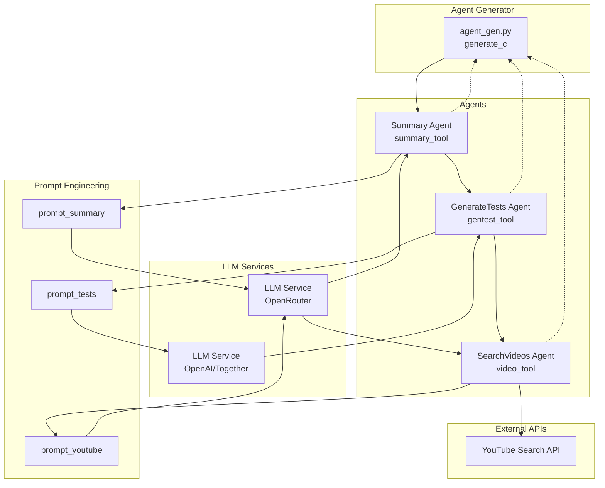
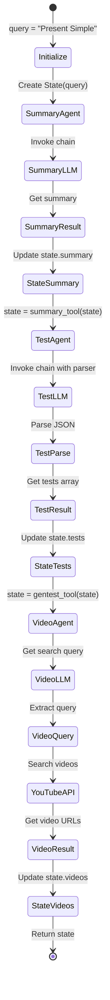
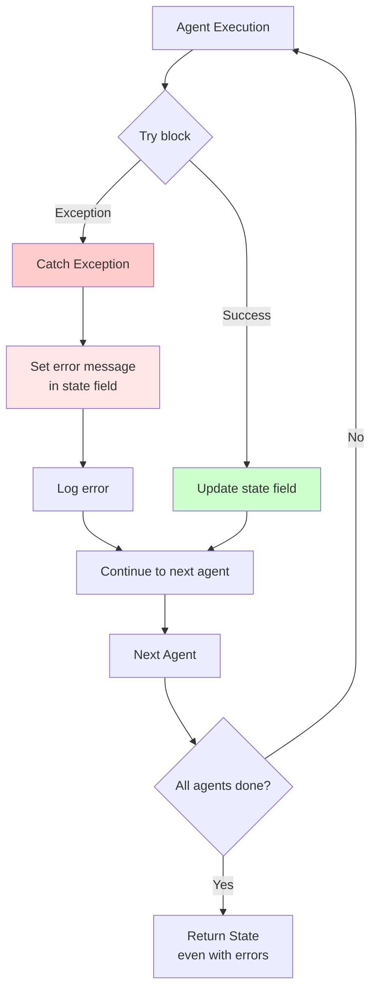

# Диаграмма работы агентов

## Архитектура агентов



## Последовательность выполнения агентов



## Детальная работа Summary Agent

```mermaid
flowchart TD
    Start([summary_tool called]) --> Input[Input: State with query]
    Input --> Chain[prompt_summary | llm_s | output]
    
    Chain --> Prompt[Prompt Template:<br/>'Создай конспект по теме {query}']
    Prompt --> LLM[LLM: OpenRouter]
    
    LLM --> Response[Response: Конспект текста]
    Response --> Update[Update State.summary]
    Update --> Return[Return State]
    
    Error{Exception?}
    Chain -.->|Error| Error
    Error --> ErrorMsg[Set state.summary = 'Ошибка: ...']
    ErrorMsg --> Return
    
    Return --> End([End])
    
    style LLM fill:#e1f5ff
    style Error fill:#ffcccc
```

## Детальная работа Test Agent

```mermaid
flowchart TD
    Start([gentest_tool called]) --> Input[Input: State with query]
    Input --> Setup[Setup: StructuredOutputParser<br/>ResponseSchema: title, questions]
    
    Setup --> Chain[prompt_tests | llm_t | parser]
    
    Chain --> Prompt[Prompt Template:<br/>'Создай тест из 5-10 вопросов<br/>в формате JSON']
    Prompt --> LLM[LLM: OpenRouter]
    
    LLM --> RawResponse[Raw JSON Response]
    RawResponse --> Parse[Parse JSON string]
    
    Parse --> Validate{Valid JSON?}
    Validate -->|Yes| Extract[Extract questions array]
    Validate -->|No| Error[Set error question]
    
    Extract --> Update[Update State.tests = questions]
    Error --> Update
    
    Update --> Return[Return State]
    Return --> End([End])
    
    style LLM fill:#e1f5ff
    style Parse fill:#fff4e1
    style Error fill:#ffcccc
```

## Детальная работа Video Agent

```mermaid
flowchart TD
    Start([video_tool called]) --> Input[Input: State with query]
    Input --> Chain1[prompt_youtube | llm_t | StrOutputParser]
    
    Chain1 --> Prompt[Prompt Template:<br/>'Создай поисковый запрос<br/>для YouTube по теме {query}']
    Prompt --> LLM[LLM: OpenRouter]
    
    LLM --> SearchQuery[Smart Search Query]
    SearchQuery --> Clean[Clean and strip query]
    
    Clean --> YouTubeAPI[VideosSearch<br/>smart_query, limit=3]
    
    YouTubeAPI --> Response[Response: videos result]
    Response --> Extract[Extract links:<br/>v['link'] for v in result]
    
    Extract --> Update[Update State.videos = links]
    
    Error{Exception?}
    YouTubeAPI -.->|Error| Error
    Error --> ErrorMsg[Set state.videos = ['Ошибка: ...']]
    ErrorMsg --> Update
    
    Update --> Return[Return State]
    Return --> End([End])
    
    style LLM fill:#e1f5ff
    style YouTubeAPI fill:#ffe1f5
    style Error fill:#ffcccc
```

## Структура State во время выполнения

```mermaid
graph LR
    subgraph "State Initial"
        S1[State<br/>query: 'Present Simple'<br/>summary: None<br/>tests: None<br/>videos: None]
    end
    
    subgraph "After Summary"
        S2[State<br/>query: 'Present Simple'<br/>summary: '...'<br/>tests: None<br/>videos: None]
    end
    
    subgraph "After Tests"
        S3[State<br/>query: 'Present Simple'<br/>summary: '...'<br/>tests: [{...}]<br/>videos: None]
    end
    
    subgraph "After Videos"
        S4[State<br/>query: 'Present Simple'<br/>summary: '...'<br/>tests: [{...}]<br/>videos: ['url1', 'url2']]
    end
    
    S1 -->|summary_tool| S2
    S2 -->|gentest_tool| S3
    S3 -->|video_tool| S4
```

## Обработка ошибок в агентах



