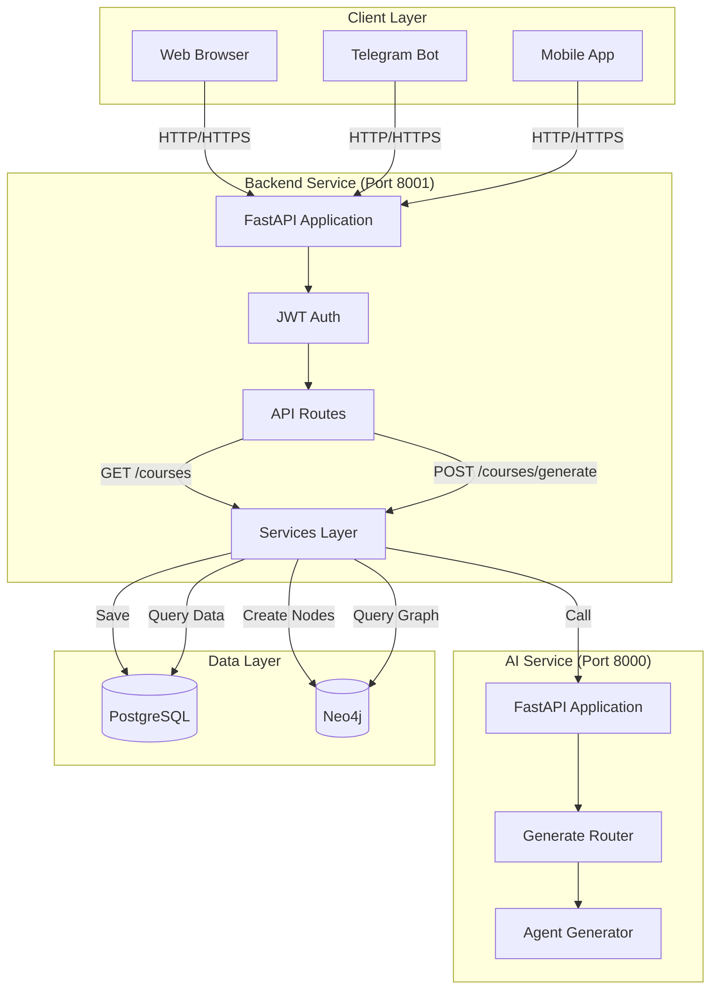
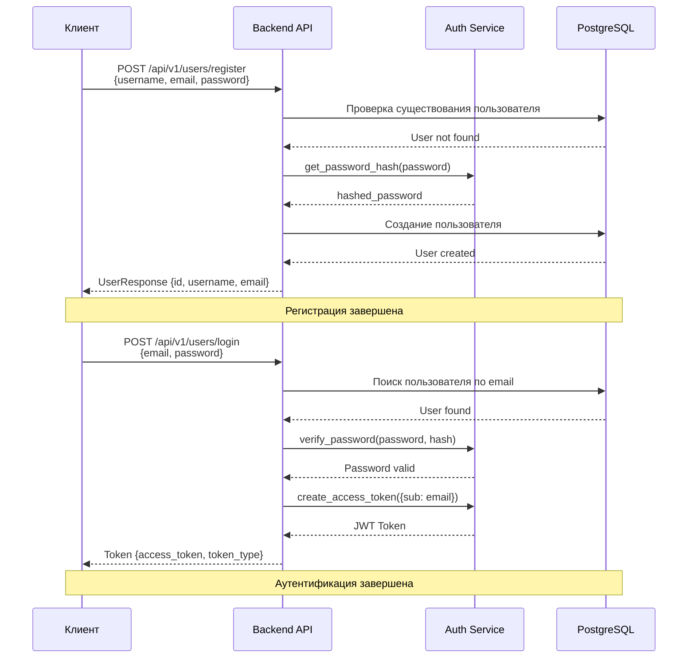
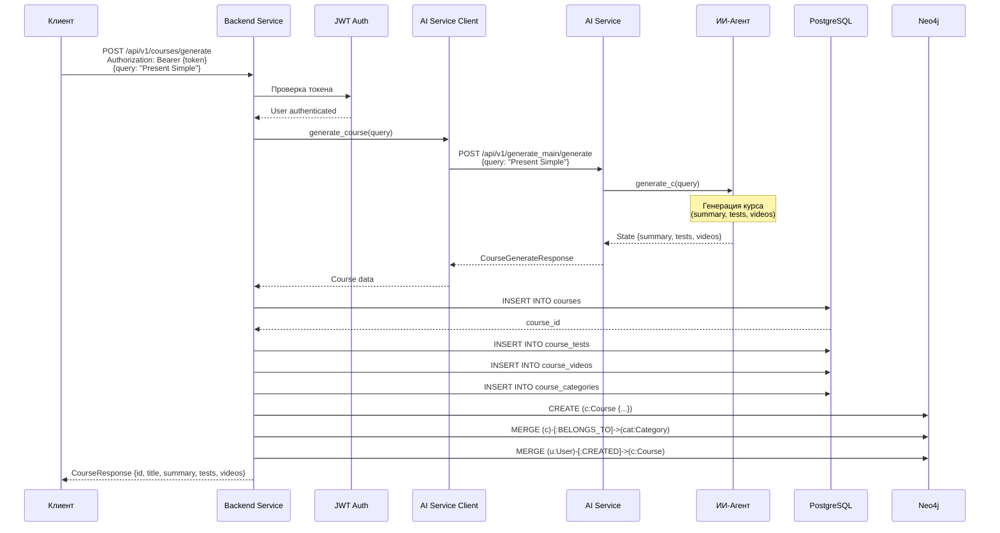

# Диаграмма работы API

## Архитектура API запросов



## Процесс аутентификации



## Процесс генерации курса через API



## Endpoints Backend Service

```mermaid
graph LR
    subgraph "User Endpoints"
        Register[POST /users/register]
        Login[POST /users/login]
        Me[GET /users/me]
    end
    
    subgraph "Course Endpoints"
        Generate[POST /courses/generate]
        Create[POST /courses]
        GetById[GET /courses/{id}]
        GetAll[GET /courses]
        MyCourses[GET /courses/user/my-courses]
        Graph[GET /courses/graph]
        GraphById[GET /courses/graph/{id}]
        Delete[DELETE /courses/{id}]
    end
    
    subgraph "Health"
        Health[GET /health]
        Root[GET /]
    end
```

## Endpoints AI Service

```mermaid
graph LR
    subgraph "Generation"
        Generate[POST /generate_main/generate]
        GenHealth[GET /generate_main/health]
    end
    
    subgraph "Health"
        Health[GET /health]
        Root[GET /]
    end
```

## Схема ответов API

### Успешный ответ

```json
{
  "query": "Present Simple",
  "summary": "Конспект по теме...",
  "tests": [
    {
      "text": "Вопрос?",
      "options": ["A", "B", "C"],
      "correct_answer": "B"
    }
  ],
  "videos": [
    "https://youtube.com/watch?v=...",
    "https://youtube.com/watch?v=..."
  ]
}
```

### Ошибка

```json
{
  "error": "ValidationError",
  "message": "Query cannot be empty",
  "details": {
    "field": "query",
    "value": ""
  }
}
```

