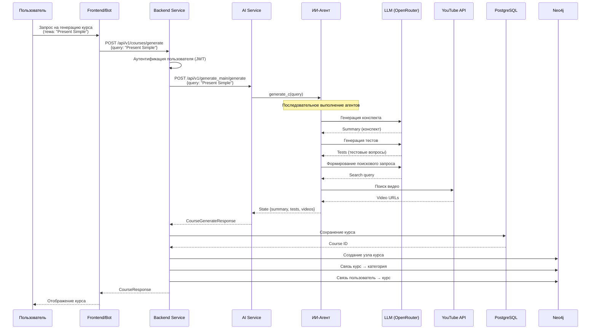
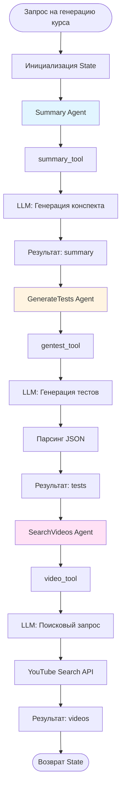
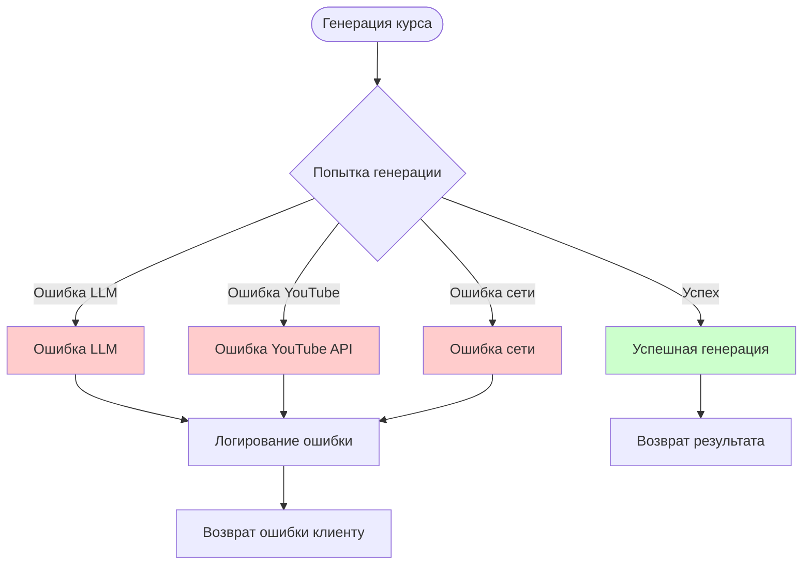

# Диаграмма генерации курса

## Общий процесс генерации курса



## Детальный процесс работы агентов



## Схема данных State

```
State {
    query: str           # Тема курса
    summary: str         # Конспект
    tests: List[Dict]    # Тесты [{text, options, correct_answer}]
    videos: List[str]    # URL видео
}
```

## Обработка ошибок



