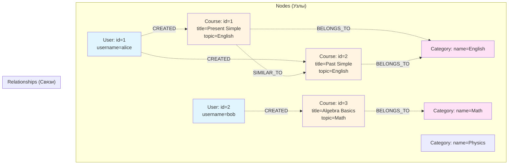
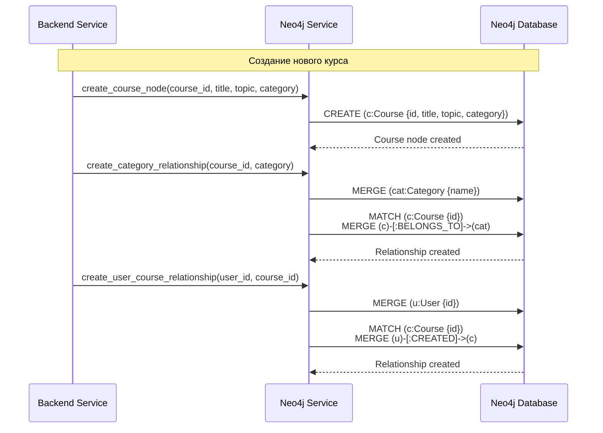
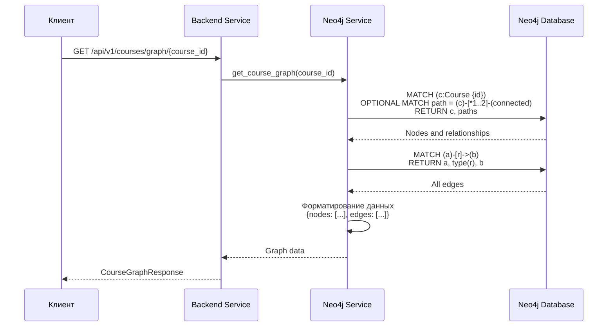

# Диаграмма работы графа знаний

## Структура графа знаний



## Создание узла курса в графе



## Запрос графа знаний



## Типы узлов и связей

### Узлы (Nodes)

| Тип | Свойства | Описание |
|-----|----------|----------|
| **User** | `id`, `username`, `email` | Пользователь системы |
| **Course** | `id`, `title`, `topic`, `category` | Курс |
| **Category** | `name` | Категория курсов |

### Связи (Relationships)

| Тип | От → К | Свойства | Описание |
|-----|--------|----------|----------|
| **CREATED** | User → Course | - | Пользователь создал курс |
| **BELONGS_TO** | Course → Category | - | Курс принадлежит категории |
| **SIMILAR_TO** | Course → Course | `score` | Похожие курсы |

## Пример Cypher запросов

### Создание узла курса

```cypher
CREATE (c:Course {
    id: $course_id,
    title: $title,
    topic: $topic,
    category: COALESCE($category, 'Uncategorized')
})
```

### Создание связи курс → категория

```cypher
MERGE (cat:Category {name: $category})
WITH cat
MATCH (c:Course {id: $course_id})
MERGE (c)-[:BELONGS_TO]->(cat)
```

### Получение графа для курса

```cypher
MATCH (c:Course {id: $course_id})
OPTIONAL MATCH path = (c)-[*1..2]-(connected)
RETURN c, collect(DISTINCT path) as paths
```

### Поиск похожих курсов

```cypher
MATCH (c1:Course {id: $course_id1})-[r:SIMILAR_TO]-(c2:Course)
WHERE r.score > 0.7
RETURN c2, r.score
ORDER BY r.score DESC
LIMIT 5
```

## Визуализация графа

Граф знаний можно визуализировать в веб-интерфейсе используя библиотеки:

- **D3.js** — для кастомной визуализации
- **vis.js** — готовое решение для графов
- **Cytoscape.js** — мощная библиотека для графов

Формат данных для визуализации:

```json
{
  "nodes": [
    {
      "id": "course_1",
      "label": "Present Simple",
      "type": "Course",
      "data": {
        "id": 1,
        "title": "Present Simple",
        "topic": "English"
      }
    }
  ],
  "edges": [
    {
      "source": "course_1",
      "target": "category_English",
      "type": "BELONGS_TO"
    }
  ]
}
```

